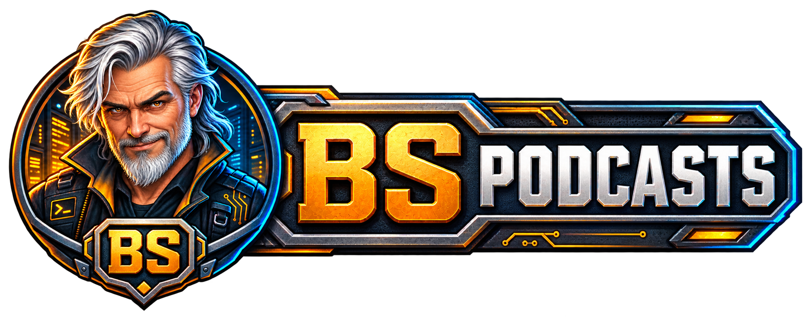
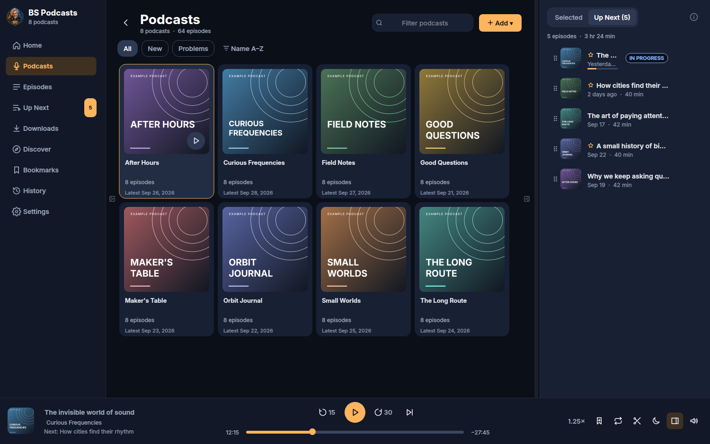
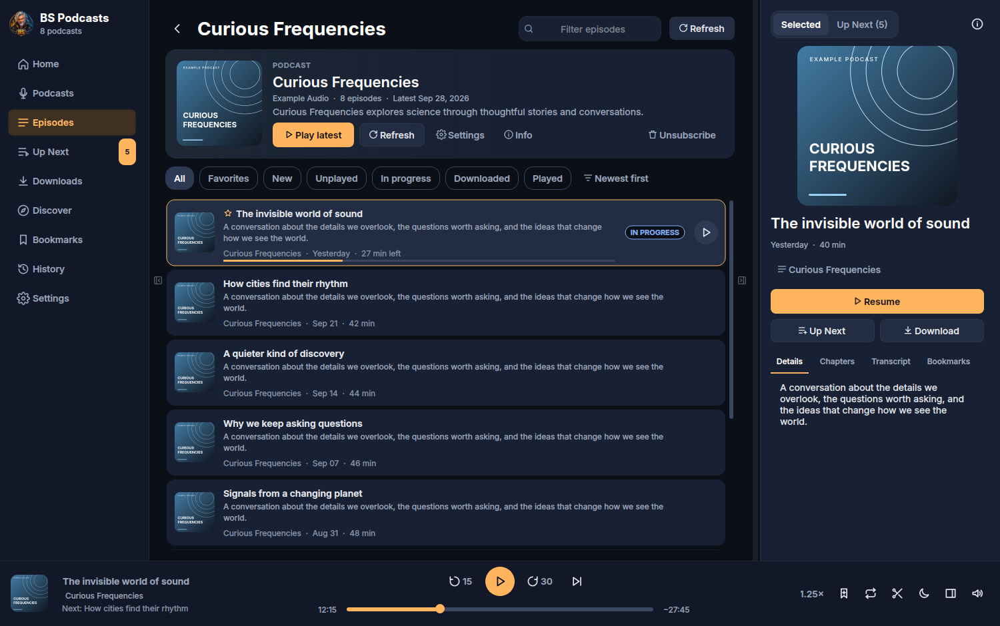

  

A desktop player for the podcasts you already have.

Listen, download and organize your podcasts on **Windows, macOS and Linux**.
Keep your subscriptions, episode details and listening queue together, with
playback controls always within reach.

## Screenshots

### Your podcast library and Up Next

Browse your shows while keeping the next episodes in view.

### Episodes, details and playback

Pick up where you left off, browse a show's episodes and keep the details beside
your player.

*Screenshots show an isolated example library using real comedy/humor audio
feeds and public-domain cover art from [LibriVox](https://librivox.org/pages/public-domain/).*

## Features

- **Your subscriptions:** add podcast feeds or import and export OPML.
- **Listen your way:** stream episodes or download them for offline listening.
- **Keep things organized:** Up Next and favorites.
- **Stay in control:** playback speed, skip controls and a sleep timer.
- **Find your place:** listening history, saved progress and bookmarks.
- **Go deeper:** chapters and transcripts when the podcast provides them.
- **Bring your own audio:** import local audio files with their metadata.
- **Discover something new:** search podcast directories from inside the app.

## Download and run

Choose the latest package for your operating system from the repository's
**Releases** page.

| Platform | Getting started |
| --- | --- |
| Windows x64 | Extract the ZIP and open `BS Podcasts.exe`. Keep the complete `BS Podcasts` folder together, including `_internal`. |
| macOS — Apple Silicon | Extract the ZIP and open `BS Podcasts.app`. Requires macOS 14 or later. |
| Linux x86-64 | Extract the archive, run `bash setup.sh`, then `bash start.sh`. Requires Python 3.14.7+, glibc 2.43+ and compatible desktop/audio libraries. |

The Windows package is unsigned. The macOS package is ad-hoc signed and not
notarized, so your operating system may display a warning. Only run packages you
trust. Close the app before replacing it during an update.

## Your library

Your subscriptions, settings and listening progress are stored locally. You can
choose where downloaded episodes are saved. Keep a backup of your library and
preserve your data when updating the app.

Finding shows, refreshing feeds, loading artwork and streaming use the network.
Downloaded episodes can be played offline.

## Copyright

BS Podcasts — **all rights reserved**. Third-party software and fonts retain
their own licenses. See the [third-party notices](packaging/THIRD-PARTY-NOTICES.txt).
